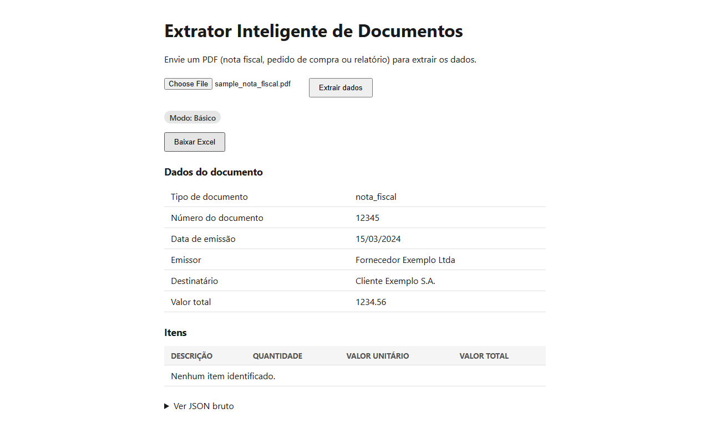

# Extrator Inteligente de Documentos

[](https://github.com/joaoferreira32/extrator-documentos/actions/workflows/tests.yml)

**[Demo online](https://extrator-docs.onrender.com)** — hospedada no plano gratuito
do Render: se ninguém acessou nos últimos minutos, o serviço hiberna e a primeira
visita pode demorar ~50s para responder enquanto ele acorda.

Extrai automaticamente os dados de **notas fiscais (DANFE)** e **boletos bancários**
em PDF — emissor, destinatário, valores, datas, itens — e gera uma planilha Excel
pronta para conferência. Evita a digitação manual de documentos fiscais, com um
indicador de confiança em cada campo extraído para o usuário saber o que revisar.



## Destaques

- **Funciona sem IA:** extratores por tipo de documento (padrão Strategy) leem
  campos por rótulo e reconstroem a tabela de itens da DANFE pela posição x/y das
  palavras. A IA (Claude) é um upgrade opcional, com fallback automático.
- **Na DANFE, a confiança é verificada, não chutada:** CNPJ do emissor e número da
  nota são conferidos contra a chave de acesso (com dígito verificador); totais são
  validados pela fórmula da nota.
- **Correção antes de exportar:** qualquer campo pode ser editado na tela; o Excel
  marca o que foi corrigido e guarda o valor original em comentário.
- **Excel com aba de leitura e abas de dados:** um Relatório em blocos (por documento,
  com hierarquia visual) ao lado de Documentos/Itens/Campos adicionais/Avisos (Tabelas
  nomeadas, prontas pra Tabela Dinâmica/Power Query), valores em R$, datas reais e chave
  de 44 dígitos preservada. Num lote, ganha total e gráfico de valor por documento; as
  abas de dados têm listas suspensas e proteção sem senha (filtro continua funcionando).
- **Segurança e privacidade:** proteção contra injeção de fórmula no Excel;
  nenhum dado pessoal real no repositório nem no histórico do Git.
- **297 testes:** 262 rodam por padrão (unitários, regressão sobre um boleto e uma DANFE
  reais anonimizados, e um verificador que lê o `.xlsx` gerado como XML bruto pra pegar
  erro que o Excel rejeitaria mas o openpyxl não veria); mais 26 de interface num
  navegador real (Playwright) e 9 que validam o Excel contra o SDK oficial da Microsoft.
- **CI no GitHub Actions** a cada push, e log estruturado por extração (tempo, extrator
  escolhido, campos vazios/de baixa confiança) com id de correlação por requisição.
- **OCR opcional** (Tesseract) para PDFs escaneados.

## Stack

Python · FastAPI · pdfplumber · PyMuPDF · Tesseract · openpyxl · Claude API (opcional) · HTML/CSS/JS puro · Playwright

## Como funciona

O PDF passa por três etapas: **texto → campos → planilha**.

1. **Texto.** O `pdfplumber` lê o texto digital do PDF (e a posição x/y de cada
   palavra). Se o PDF for uma imagem escaneada, cai para [OCR](#ocr-opcional).
2. **Campos.** O extrator do tipo de documento estrutura o texto em JSON
   (`DocumentoExtraido`). Há dois modos, que preenchem o mesmo formato — por isso
   tela e Excel funcionam igual nos dois.
3. **Planilha.** A tela mostra o resultado, deixa corrigir e baixa o `.xlsx`.

### Modo básico (padrão, sem configuração)

- Escolhe o extrator pelo tipo do documento: **DANFE**, **boleto** ou **genérico**
  (pedido de compra, relatório).
- Captura os campos por **rótulo** conhecido (`Beneficiário`, `Sacado`, `Vencimento`…),
  não por regex solto no texto todo — isso evita roubar pedaços de outros números.
- Identifica CNPJ/CPF pelo formato e associa ao emissor/destinatário.
- Boleto: também linha digitável, nosso número e vencimento.
- DANFE: valida a chave de acesso e reconstrói a tabela de itens pela **posição**
  das palavras (regex sobre texto corrido perde a estrutura de colunas).
- Cada campo carrega uma confiança (`alta`, `media` ou `baixa`) no campo
  `confiancas` da resposta da API.

### Modo IA (opcional)

Com `ANTHROPIC_API_KEY` configurada, o Claude extrai os mesmos campos (inclusive a
lista de itens) via Structured Outputs. Se a chamada falhar
por qualquer motivo, o sistema volta sozinho ao modo básico e avisa na tela.
A resposta sempre traz `modo_extracao` (`"basico"` ou `"ia"`), exibido como badge.

### Confiança e correção na tela

Cada campo mostra **Alta**, **Média** ou **Baixa** (sempre com ícone e texto, nunca só
cor), há um resumo no topo ("X de Y campos com alta confiança") e um banner com os
avisos da extração. Campos de confiança baixa ou obrigatórios vazios já vêm abertos
para edição; **qualquer campo pode ser corrigido** antes de exportar. No modo IA não
há indicador de confiança por campo, mas a edição funciona igual.

### Excel

O botão **Baixar Excel** gera um `.xlsx` com 5 abas:

| Aba | Conteúdo |
|---|---|
| **Relatório** | a mesma informação em blocos, por documento (emitente, destinatário, valores, itens…), pra quem só quer *ler*; é a aba que abre, com a legenda das cores que aparecem de fato |
| **Documentos** | uma linha por documento (tipo, número, datas, emissor e destinatário com CNPJ/CPF em colunas próprias, valor total, confiança geral) |
| **Itens** | descrição, quantidade, valor unitário e total, com linha de total |
| **Campos adicionais** | chave de acesso, CFOP, nosso número, linha digitável… com a confiança de cada um |
| **Avisos** | o que a extração pediu para conferir |

As quatro últimas são Tabelas nomeadas do Excel, com cabeçalho e coluna `ID` congelados, e
o `ID` liga as abas. Confiança média/baixa e campos corrigidos ficam destacados, com
comentário. Aba de dados sem nenhuma linha fica oculta (não removida: quem usa Power Query
pelo nome da aba não quebra). A estrutura (lista de documentos, `ID`) comporta vários
documentos no mesmo arquivo.

Num lote (2 ou mais documentos), a aba Documentos ganha uma linha de **total do lote** e um
**gráfico de barras** do valor total por documento, abaixo da tabela. O gráfico só aparece
com 2 ou mais valores numéricos; um documento cujo valor virou texto fica de fora, em vez
de aparecer como uma barra zero.

Nas abas de dados também há **listas suspensas** (Tipo, e a Confiança dos campos
adicionais, as únicas colunas com um conjunto fechado de valores), **cor condicional
nativa** na coluna Confiança (acompanha o texto) e **proteção sem senha**: cabeçalho e
totais travados, dados livres, filtro e ordenação funcionando. Com a aba protegida a Tabela
não cresce; para acrescentar linhas, Revisão > Desproteger planilha.

## Como rodar (Windows / PowerShell)

Requer Python 3.

```powershell
cd backend
python -m venv .venv
.venv\Scripts\python.exe -m pip install -r requirements.txt
.venv\Scripts\python.exe -m uvicorn app.main:app --reload
```

Acesse `http://localhost:8000` (interface) ou `http://localhost:8000/docs` (Swagger).

Essa forma funciona **sem ativar o venv**. Se preferir ativá-lo
(`.venv\Scripts\Activate.ps1`; o PowerShell pode bloquear scripts por política de
execução), depois basta `uvicorn app.main:app --reload`.

**Modo IA (opcional):** copie `backend\.env.example` para `backend\.env`, preencha
`ANTHROPIC_API_KEY=` com sua chave e reinicie o servidor. Sem a chave, tudo continua
funcionando em modo básico.

### Testes

```powershell
cd backend
.venv\Scripts\python.exe -m pytest tests -v
```

São 262 testes rodando por padrão, entre unitários e de regressão. Os de regressão usam
o texto bruto de um boleto e de trechos de uma DANFE reais, com os dados pessoais
trocados por fictícios. Eles existem porque os cenários que escrevi à mão não
reproduziam os bugs que apareciam no documento de verdade.

O teste de OCR real só roda se o Tesseract e o idioma português estiverem instalados.
Sem eles, ele é pulado em vez de falhar. Os outros testes de OCR usam mocks.

Toda vez que dou push (ou abro um PR), o [GitHub Actions](.github/workflows/tests.yml)
roda esses 262 testes sozinho — é o badge que aparece no topo deste README.

Há mais 26 testes de interface, que rodam num Chromium de verdade via Playwright com
PDFs fictícios gerados na hora. Eles são opcionais e têm dependências à parte:

```powershell
.venv\Scripts\python.exe -m pip install -r requirements-dev.txt
.venv\Scripts\python.exe -m playwright install chromium
.venv\Scripts\python.exe -m pytest tests\e2e --e2e -v
```

Tem também 9 testes que validam o `.xlsx` exportado contra o SDK oficial da Microsoft
(Open XML), além do verificador próprio (que já roda nos 262 de sempre). São Windows-only
e opcionais, porque baixam esse SDK na primeira vez:

```powershell
.venv\Scripts\python.exe -m pytest tests\test_ooxml.py --ooxml-sdk -v
```

## OCR (opcional)

O sistema sempre tenta ler o texto digital primeiro. Se esse texto vier vazio ou com
menos de 20 caracteres, o que costuma indicar um PDF escaneado, cada página é
convertida em imagem pelo PyMuPDF e o Tesseract lê o resultado. Daí em diante o texto
segue pelo mesmo extrator de sempre, sem caminho separado. A resposta traz o campo
`origem_texto`, com o valor `digital` ou `ocr`, que aparece como badge na tela.

Alguns pontos do funcionamento:

- Se o Tesseract não estiver instalado, um PDF escaneado devolve o aviso "OCR não está
  disponível". O app não quebra.
- A renderização das páginas usa PyMuPDF em vez de Poppler ou ImageMagick porque ele
  instala só com pip. Assim o OCR depende de um único programa externo, o Tesseract.
- O OCR confunde caracteres parecidos, como O com 0, I com 1 e S com 5. A correção é
  aplicada só nos campos que já sabemos ser numéricos, como CNPJ, CPF e valores.
  Corrigir o texto inteiro destruiria palavras normais.
- Duas limitações: a tabela de itens da DANFE precisa de texto digital, então via OCR o
  campo `itens` fica vazio; e a correção de caracteres não cobre o número do documento
  nem texto livre.

### Instalando o Tesseract (Windows)

O Tesseract é um programa do sistema, não um pacote Python.

```powershell
winget install --id UB-Mannheim.TesseractOCR -e
```

Também dá para baixar o instalador em
[github.com/UB-Mannheim/tesseract](https://github.com/UB-Mannheim/tesseract/wiki).

Duas pegadinhas que encontrei testando:

1. O instalador não adiciona o Tesseract ao PATH. O app contorna isso tentando
   `C:\Program Files\Tesseract-OCR\tesseract.exe` antes de desistir. Se você instalou em
   outro lugar, adicione a pasta ao PATH.
2. A instalação via winget traz só o idioma inglês. Baixe o
   [`por.traineddata`](https://github.com/tesseract-ocr/tessdata_fast/raw/main/por.traineddata)
   e copie para `C:\Program Files\Tesseract-OCR\tessdata\`, usando um terminal como
   administrador. Sem permissão de administrador, salve o arquivo em qualquer pasta e
   aponte a variável `TESSDATA_PREFIX` para ela.

Para conferir, rode `& "C:\Program Files\Tesseract-OCR\tesseract.exe" --list-langs`. A
saída deve listar `por`.

## Decisões técnicas

**Um extrator por tipo de documento (padrão Strategy).** Cada tipo tem seu próprio
conjunto de rótulos. Para dar suporte a um documento novo basta criar um arquivo e
registrá-lo numa lista, sem tocar nos extratores que já funcionam.

**Busca por rótulo em vez de regex solto pelo texto.** O extrator procura o rótulo
conhecido e lê o que vem depois dele. Isso evita capturar pedaços de outros números e
permite associar um CNPJ ao nome que está mais próximo dele.

**Confiança medida por evidência.** Ter encontrado o rótulo não é garantia de nada: em
um dos testes o emissor saiu errado mesmo com o rótulo localizado. Na DANFE, o CNPJ e o
número da nota são conferidos contra a chave de acesso, os totais contra a fórmula da
nota, e a soma dos itens contra o valor total dos produtos.

**Texto girado descartado na leitura.** O canhoto da DANFE é impresso na vertical e o
pdfplumber o devolve como lixo antes do conteúdo real, o que fazia o emissor sair como
"FOLHA 1/". Descartar esses caracteres na leitura resolve para todos os extratores de
uma vez.

**Structured Outputs no modo IA.** Usando `client.messages.parse(output_format=...)`, a
resposta já chega validada pelo schema Pydantic, sem depender de pedir JSON no prompt.

**Campos numéricos flexíveis (`float | string`).** Viram número quando a conversão é
confiável e caem para texto quando não é, em vez de quebrar a extração inteira.

**No Excel, só valor monetário vira número.** A chave de acesso tem 44 dígitos e o Excel
guarda apenas 15 de precisão, o que a destruiria. CFOP e número do documento têm zeros à
esquerda. Os três ficam como texto. Todo texto vindo do PDF é gravado como texto, nunca
como fórmula.

**Recursos nativos do Excel, com um descarte.** Total do lote, gráfico, listas suspensas e
proteção entraram; trocar todos os destaques de confiança por formatação condicional não.
A cor de um campo (Emissor, Valor total…) documenta *como* ele foi extraído ("veio com
confiança baixa"), não o valor que está na célula agora: se a cor seguisse o valor,
corrigir o campo apagaria o rastro que o comentário da célula preserva. Só a coluna
Confiança dos campos adicionais usa regra condicional, porque ali o texto da célula é o
próprio valor. Um detalhe que o schema não pega: o openpyxl 3.1 não escreve o elemento que
mantém os eixos do gráfico visíveis, e o Excel 365 os esconde; o verificador do `.xlsx`
acusa. E a proteção só entrou depois de testar no Excel de verdade que filtro e ordenação
da Tabela continuam funcionando com a aba protegida.

**Frontend servido pelo próprio FastAPI**, em HTML, CSS e JavaScript puros. Um processo
só em `localhost:8000`, sem CORS e sem CDN externo.

**Trabalho pesado fora do event loop.** Ler o PDF, extrair os campos e montar o Excel são
síncronos e podem levar segundos — chamados direto dentro de uma rota `async def`, eles
bloqueariam o servidor inteiro (até o `/health`) enquanto uma única extração roda. Medido
de propósito antes de corrigir: uma extração de 9s deixava outra pessoa esperando o tempo
todo. `fastapi.concurrency.run_in_threadpool` resolve.

**Log estruturado sem infraestrutura pesada.** Uma linha em JSON por extração (tempo,
extrator escolhido, campos vazios ou de baixa confiança) e um id por requisição
(`X-Request-ID` no cabeçalho da resposta, correlacionado à mesma linha do log) — só
`logging` da biblioteca padrão, sem Sentry nem serviço pago.

## Limitações conhecidas e próximos passos

- Só a DANFE tem extração de itens no modo básico. Boleto e documentos genéricos ficam
  com `itens` vazio, e o modo IA cobre esses casos.
- As limitações do OCR estão na seção [OCR](#ocr-opcional).
- Na DANFE, série, natureza da operação, data de saída e inscrição estadual do emitente
  ainda não são extraídas.
- Não existe interface para processar vários PDFs de uma vez. A tela envia um documento
  por vez, embora a API e o Excel já aceitem uma lista.
- As heurísticas foram feitas para o formato comercial brasileiro, com datas em
  dd/mm/aaaa e valores em reais, e validadas com um boleto e uma DANFE reais. Outros
  layouts podem exigir ajustes.
- Números de tempo de extração (medidos, ainda não publicados aqui) e o gargalo real
  por trás deles: não é a extração em si, e sim rodar sem limite de concorrência.
- Rate limit simples (por IP) nos endpoints de upload — a demo pública ainda não tem.
- Um parágrafo de "decisões descartadas" na seção de Decisões técnicas (o que foi
  cogitado e por que não entrou), além do que já existe (ex: linha de título mesclada).

## Autor

João Pedro Ferreira — [LinkedIn](https://www.linkedin.com/in/joaopedroferreira-2824d9324/)

## Status

MVP funcional: upload, extração básica ou via IA, tabela com indicador de confiança,
correção dos campos e download em Excel.
